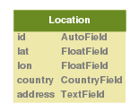

Base
====

Models
------

.. automodule:: apps.i4p_base.models
   :members:

Views
-----

.. automodule:: apps.i4p_base.views
   :members:

URLs
----

.. literalinclude:: ../apps/i4p_base/urls.py
        :language: python

