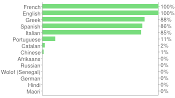
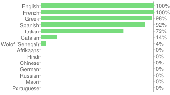
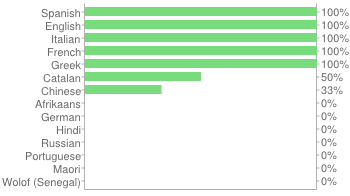
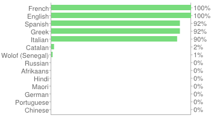
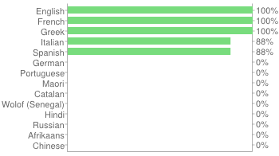

###########
Translators
###########

Module States
#############

Translations are pushed to Transifex_ and everyone is welcomed to
contribute to an existing language or start a new one!

Below are graphics representing the state of each module.

Base
====

https://www.transifex.com/projects/p/imaginationforpeople/resource/i4p_base/

Member
======

https://www.transifex.com/projects/p/imaginationforpeople/resource/member/

Partner
=======

https://www.transifex.com/projects/p/imaginationforpeople/resource/partner/

Project Sheet
=============

https://www.transifex.com/projects/p/imaginationforpeople/resource/project_sheet/

Workgroup
=========

https://www.transifex.com/projects/p/imaginationforpeople/resource/workgroup/

.. _Transifex: https://www.transifex.com/projects/p/imaginationforpeople/
